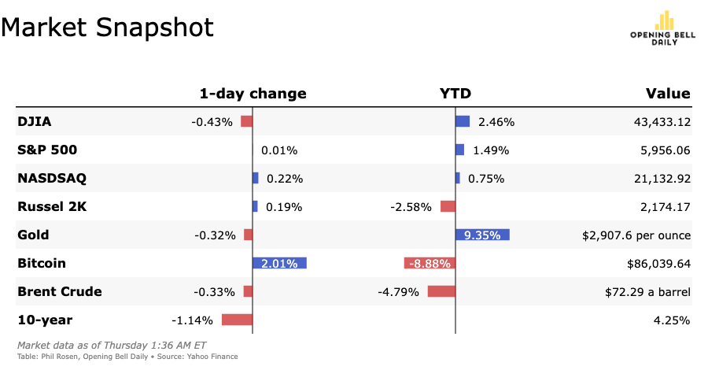

# Opening Bell Daily for OpenBB Workspace



Add to your OpenBB workspace by adding the following custom backend: https://openbb-opening-bell-daily.fly.dev


You may also run it locally with

```bash
uvicorn main:app --port 8080
````

and update the custom backend accordingly.
